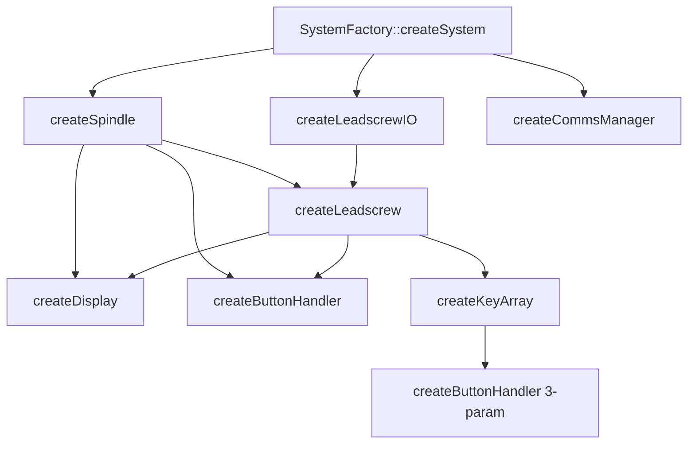

# Factory Pattern Implementation

This directory contains the factory pattern implementation for TeensyELS, providing platform-specific object creation and dependency wiring.

## Overview

The factory pattern abstracts object creation logic, allowing platform-specific implementations while maintaining a common interface. This enables the same business logic to run on different hardware platforms (Teensy, ESP32) with appropriate hardware abstractions.

## Architecture

```
lib/factory/
├── system_factory.h              # Factory interface and declarations
├── system_factory.cpp            # Common factory logic (createSystem)
├── teensy_system_factory.cpp     # Teensy-specific implementations
├── esp32_system_factory.cpp      # ESP32-specific implementations
└── README.md                      # This documentation
```

## Factory Interface

### SystemFactory Class

The `SystemFactory` provides static methods for creating system components:

```cpp
class SystemFactory {
public:
    // Main entry point - creates complete system
    static std::unique_ptr<DependencyContainer> createSystem();
    
private:
    // Platform-specific creation methods (implemented in platform files)
    static std::unique_ptr<ISpindle> createSpindle();
    static std::unique_ptr<LeadscrewIO> createLeadscrewIO();
    static std::unique_ptr<ILeadscrew> createLeadscrew(ISpindle* spindle, LeadscrewIO* io);
    static std::unique_ptr<IDisplay> createDisplay(ISpindle* spindle, ILeadscrew* leadscrew);
    static std::unique_ptr<IButtonHandler> createButtonHandler(ISpindle* spindle, ILeadscrew* leadscrew);
    
#ifdef ESP32
    static std::unique_ptr<IButtonHandler> createButtonHandler(ISpindle* spindle, ILeadscrew* leadscrew, IKeyArray* keyArray);
    static std::unique_ptr<IKeyArray> createKeyArray(ILeadscrew* leadscrew);
    static std::unique_ptr<ICommsManager> createCommsManager();
#endif
};
```

## Platform-Specific Implementations

### Teensy Implementation (`teensy_system_factory.cpp`)

Creates Teensy-specific components:

```cpp
std::unique_ptr<ISpindle> SystemFactory::createSpindle() {
#ifdef ELS_SPINDLE_DRIVEN
    return std::make_unique<Spindle>();
#else
    return std::make_unique<Spindle>(ELS_SPINDLE_ENCODER_A, ELS_SPINDLE_ENCODER_B);
#endif
}

std::unique_ptr<LeadscrewIO> SystemFactory::createLeadscrewIO() {
    return std::make_unique<LeadscrewIOTeensy>();
}

std::unique_ptr<IButtonHandler> SystemFactory::createButtonHandler(ISpindle* spindle, ILeadscrew* leadscrew) {
    auto concreteSpindle = static_cast<Spindle*>(spindle);
    auto concreteLeadscrew = static_cast<Leadscrew*>(leadscrew);
    
    return std::make_unique<ButtonHandler>(concreteSpindle, concreteLeadscrew);
}
```

### ESP32 Implementation (`esp32_system_factory.cpp`)

Creates ESP32-specific components with additional functionality:

```cpp
std::unique_ptr<LeadscrewIO> SystemFactory::createLeadscrewIO() {
    return std::make_unique<LeadscrewIOESP>();
}

std::unique_ptr<IKeyArray> SystemFactory::createKeyArray(ILeadscrew* leadscrew) {
    auto concreteLeadscrew = static_cast<Leadscrew*>(leadscrew);
    return std::make_unique<KeyArray>(concreteLeadscrew);
}

std::unique_ptr<IButtonHandler> SystemFactory::createButtonHandler(ISpindle* spindle, ILeadscrew* leadscrew, IKeyArray* keyArray) {
    auto concreteSpindle = static_cast<Spindle*>(spindle);
    auto concreteLeadscrew = static_cast<Leadscrew*>(leadscrew);
    auto concreteKeyArray = static_cast<KeyArray*>(keyArray);
    
    return std::make_unique<ButtonPad>(concreteSpindle, concreteLeadscrew, concreteKeyArray);
}

std::unique_ptr<ICommsManager> SystemFactory::createCommsManager() {
    return std::make_unique<ESPCommsManager>();
}
```

## Usage Patterns

### Basic System Creation

```cpp
#include "factory/system_factory.h"

void setup() {
    // Create entire system with all dependencies wired
    auto systemContainer = SystemFactory::createSystem();
    
    // Resolve components as needed
    auto spindle = systemContainer->resolve<ISpindle>();
    auto leadscrew = systemContainer->resolve<ILeadscrew>();
    auto display = systemContainer->resolve<IDisplay>();
    
    // Initialize components
    display->init();
    leadscrew->setTargetPitchMM(1.25f);
}
```

### Component Dependency Flow

The factory creates components in dependency order:



## Design Patterns

### 1. Abstract Factory
- `SystemFactory` provides interface for creating families of related objects
- Platform-specific factories implement concrete creation logic
- Client code uses abstract interface, unaware of concrete implementations

### 2. Dependency Injection
- Factory resolves and injects dependencies into created objects
- Components receive dependencies through constructor injection
- Circular dependencies are avoided through careful ordering

### 3. Builder Pattern (Implicit)
- `createSystem()` acts as a builder, creating and wiring complex object graphs
- Dependencies are resolved step-by-step in proper order
- Final system is fully configured and ready to use

## Configuration Integration

### Hardware Configuration

Factory methods read from `config.h` to determine hardware parameters:

```cpp
std::unique_ptr<ILeadscrew> SystemFactory::createLeadscrew(ISpindle* spindle, LeadscrewIO* io) {
    return std::make_unique<Leadscrew>(
        concreteSpindle,
        io,
        ACCEL_PULSE_SEC,                              // From config.h
        LEADSCREW_INITIAL_PULSE_DELAY_US,             // From config.h
        ELS_LEADSCREW_STEPPER_PPR * ELS_GEARBOX_RATIO, // From config.h
        ELS_LEADSCREW_PITCH_MM,                       // From config.h
        ELS_SPINDLE_ENCODER_PPR                       // From config.h
    );
}
```

### Platform Detection

Platform-specific compilation is handled through preprocessor directives:

```cpp
#ifdef ESP32
    // ESP32-specific creation logic
#else
    // Teensy-specific creation logic
#endif
```

## Testing Strategy

### Unit Testing Factories

```cpp
TEST(SystemFactoryTest, CreatesValidSystem) {
    auto container = SystemFactory::createSystem();
    
    EXPECT_TRUE(container->isRegistered<ISpindle>());
    EXPECT_TRUE(container->isRegistered<ILeadscrew>());
    EXPECT_TRUE(container->isRegistered<IDisplay>());
    
    auto spindle = container->resolve<ISpindle>();
    EXPECT_NE(spindle, nullptr);
}
```

### Mock Factory for Testing

Create a test-specific factory for controlled testing:

```cpp
class TestSystemFactory {
public:
    static std::unique_ptr<DependencyContainer> createMockSystem() {
        auto container = std::make_unique<DependencyContainer>();
        
        auto mockSpindle = std::make_unique<MockSpindle>();
        auto mockLeadscrew = std::make_unique<MockLeadscrew>();
        auto mockDisplay = std::make_unique<MockDisplay>();
        
        container->registerSingleton<ISpindle>(std::move(mockSpindle));
        container->registerSingleton<ILeadscrew>(std::move(mockLeadscrew));
        container->registerSingleton<IDisplay>(std::move(mockDisplay));
        
        return container;
    }
};
```

## Adding New Platforms

To add support for a new platform (e.g., Arduino Mega):

### 1. Create Platform Factory File

```cpp
// lib/factory/arduino_system_factory.cpp
#ifdef ARDUINO_AVR_MEGA

std::unique_ptr<ISpindle> SystemFactory::createSpindle() {
    return std::make_unique<ArduinoSpindle>(ENCODER_PIN_A, ENCODER_PIN_B);
}

std::unique_ptr<LeadscrewIO> SystemFactory::createLeadscrewIO() {
    return std::make_unique<LeadscrewIOArduino>();
}

// ... other platform-specific implementations

#endif // ARDUINO_AVR_MEGA
```

### 2. Update Configuration

Add platform detection in `config.h`:

```cpp
#if defined(ESP32)
    // ESP32 configuration
#elif defined(CORE_TEENSY)
    // Teensy configuration  
#elif defined(ARDUINO_AVR_MEGA)
    // Arduino Mega configuration
    #define ELS_SPINDLE_ENCODER_A 2
    #define ELS_SPINDLE_ENCODER_B 3
    // ... other pins and settings
#endif
```

### 3. Add Platform-Specific Components

Create Arduino-specific implementations:
- `ArduinoSpindle` class
- `LeadscrewIOArduino` class  
- `ArduinoDisplay` class
- etc.

## Error Handling

### Factory Error Patterns

Factories handle errors gracefully:

```cpp
std::unique_ptr<ISpindle> SystemFactory::createSpindle() {
    try {
        return std::make_unique<Spindle>(ELS_SPINDLE_ENCODER_A, ELS_SPINDLE_ENCODER_B);
    } catch (...) {
        // For embedded systems, return nullptr instead of throwing
        return nullptr;
    }
}
```

### Validation in createSystem()

The main factory method validates successful creation:

```cpp
std::unique_ptr<DependencyContainer> SystemFactory::createSystem() {
    auto container = std::make_unique<DependencyContainer>();
    
    auto spindle = createSpindle();
    if (!spindle) {
        // Log error and return empty container
        return nullptr;
    }
    
    // Continue with other components...
}
```

## Performance Considerations

### Creation Time
- All object creation happens at startup
- No runtime performance impact
- Acceptable startup delay for embedded applications

### Memory Usage
- Factory methods use stack-based creation
- Minimal heap fragmentation
- Objects transferred to container immediately

### Compilation Impact
- Platform-specific files only compiled for target platform
- Reduced binary size through dead code elimination
- No runtime overhead for unused platforms

## Best Practices

### 1. Factory Method Design
- Keep creation methods focused on single responsibility
- Handle all required dependencies in one place
- Use configuration constants, not magic numbers

### 2. Error Handling
- Return nullptr for creation failures on embedded systems
- Provide meaningful error logging for debugging
- Validate all dependencies are created successfully

### 3. Platform Isolation
- Keep platform-specific code in separate files
- Use preprocessor directives minimally and consistently
- Test each platform implementation independently

### 4. Dependency Management
- Create components in dependency order
- Avoid circular dependencies
- Inject all required dependencies through constructors

## Troubleshooting

### Common Issues

**Linker Error: "Undefined reference to createX"**
- Missing platform-specific factory implementation
- Check preprocessor flags match target platform

**Runtime: Nullptr from resolve()**
- Factory method returned nullptr (creation failed)
- Check hardware configuration constants
- Verify all required libraries are available

**Build Error: "Multiple definitions"**
- Factory method implemented in multiple platform files
- Check conditional compilation directives

### Debugging Tips

1. **Add Creation Logging**:
```cpp
std::unique_ptr<ISpindle> SystemFactory::createSpindle() {
    Serial.println("Creating spindle...");
    auto spindle = std::make_unique<Spindle>(...);
    Serial.println(spindle ? "Spindle created successfully" : "Spindle creation failed");
    return spindle;
}
```

2. **Verify Platform Detection**:
```cpp
void setup() {
#ifdef ESP32
    Serial.println("Platform: ESP32");
#elif defined(CORE_TEENSY)
    Serial.println("Platform: Teensy");
#endif
    // ... rest of setup
}
```

3. **Test Factory Isolation**:
```cpp
// Test each creation method independently
auto spindle = SystemFactory::createSpindle();
assert(spindle != nullptr);

auto io = SystemFactory::createLeadscrewIO();  
assert(io != nullptr);
```

This factory implementation provides clean separation between platforms while maintaining a consistent interface for the application logic. It enables easy testing, platform porting, and configuration management while preserving real-time performance characteristics.